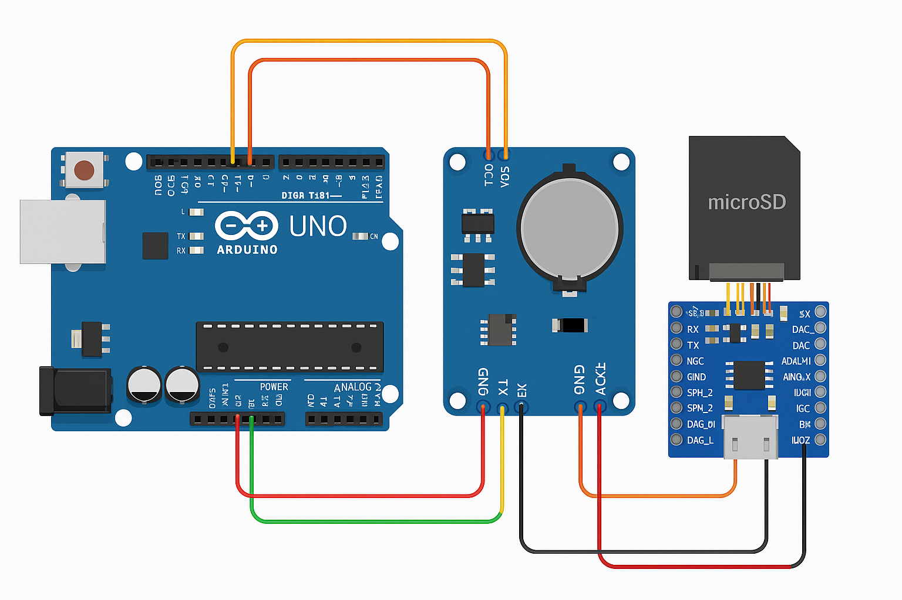

# ✅ Checklist de Conexão por Componente – Atualizado

## 🔊 DFPlayer Mini

| DFPlayer Pin  | Conectar a          | Observações                                                                 |
| ------------- | ------------------- | ---------------------------------------------------------------------------- |
| VCC           | 5V do Arduino       | Pode usar 3.3V também, mas 5V é mais estável                                 |
| GND           | GND do Arduino      | Terra comum                                                                  |
| TX            | Pino 7 do Arduino   | Vai para o RX do Arduino via SoftwareSerial (`mySerial`)                    |
| RX            | Pino 6 do Arduino   | Recebe do TX do Arduino via divisor resistivo recomendado                   |
| SPK_1 / SPK_2 | Alto-falante (opcional) | Ou use saída via P2/RCA conectando em DAC_L e DAC_R com resistores          |

> 💡 **Saída para mesa de som**: use os pinos **DAC_L**, **DAC_R** e **GND** conectados a um conector P2 ou RCA. Utilize resistores de 1kΩ para limitar corrente.

---

## ⏱️ RTC DS3231

| RTC Pin | Conectar a        | Observações                 |
| ------- | ----------------- | --------------------------- |
| VCC     | 5V do Arduino     | Pode usar 3.3V em alguns módulos |
| GND     | GND do Arduino    | Terra comum                 |
| SDA     | A4 no Arduino Uno | Comunicação I2C (dados)     |
| SCL     | A5 no Arduino Uno | Comunicação I2C (clock)     |

---

## 💾 Módulo de Cartão microSD (separado do DFPlayer)

| SD Pin | Conectar a         | Observações                               |
| ------ | ------------------ | ----------------------------------------- |
| VCC    | 5V do Arduino      | Pode exigir divisor de tensão se for 3.3V |
| GND    | GND do Arduino     | Terra comum                               |
| CS     | Pino 4 do Arduino  | Usado no código como `SD_CS_PIN`          |
| MOSI   | Pino 11 do Arduino | Comunicação SPI                           |
| MISO   | Pino 12 do Arduino | Comunicação SPI                           |
| SCK    | Pino 13 do Arduino | Comunicação SPI                           |

---

## 🔧 Conexões com Resistores (se necessário)

- Entre **DFPlayer RX** e **pino 6 do Arduino**: usar divisor resistivo (ex: 1kΩ + 2kΩ) para adaptar nível lógico de 5V para 3.3V.
- Para saída de áudio via **P2/RCA** para mesa de som: usar resistores de 1kΩ em série com DAC_L e DAC_R.

---

