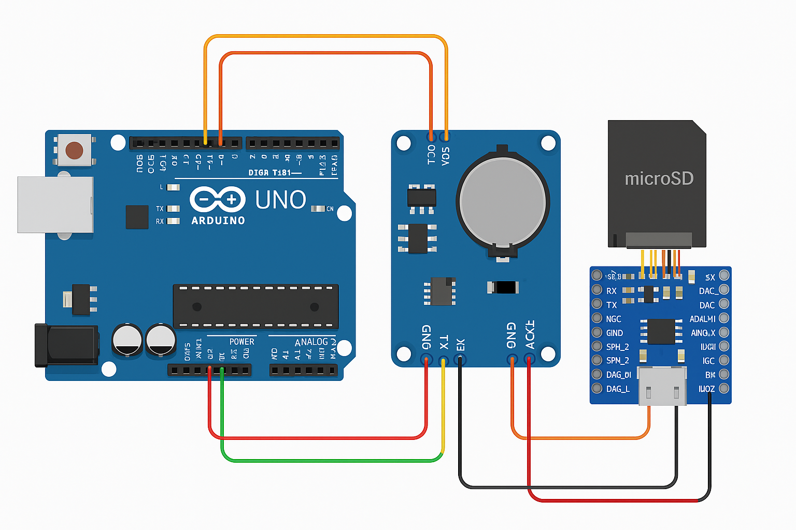

# ⏰🔊 Arduino Audio Scheduler com DFPlayer Mini e RTC DS3231

Este projeto permite que um Arduino reproduza arquivos de áudio em horários agendados, utilizando um **DFPlayer Mini**, um **RTC DS3231** e um cartão **microSD**. Os agendamentos são lidos dinamicamente de um arquivo de configuração (`config.txt`), possibilitando ajustes sem necessidade de regravar o código.

---

## 📦 Componentes Utilizados

- Arduino Uno (ou compatível)
- DFPlayer Mini MP3 Module
- Módulo RTC DS3231
- Cartão microSD (FAT32)
- Alto-falante ou saída P2/RCA
- Resistores (para divisor de tensão no RX do DFPlayer)
- Jumpers e fonte de alimentação

---

## 🧠 Funcionalidades

- Reprodução de múltiplos arquivos de áudio em sequência
- Definição da quantidade de repetições de cada áudio
- Execução com base na hora e nos dias da semana
- Configuração dinâmica via arquivo `config.txt` no cartão SD
- Compatível com saída P2/RCA para conexão em mesa de som

---

## 📁 Estrutura do Arquivo `config.txt`

O arquivo `config.txt` deve estar na raiz do cartão SD e seguir o seguinte formato:

```
HH:MM;dias_da_semana;arquivoXvezes,...
08:00;1,3,5;1x2,2x1
12:00;0,1,2,3,4,5,6;3x1
```

- `HH:MM` → horário da execução
- Dias da semana: 0=Dom, 1=Seg, ..., 6=Sáb
- `1x2` → tocar `001.mp3` duas vezes

---

## 📷 Diagrama de Ligação



---

## 📌 Conexões

Veja o arquivo [`checklist_conexao_componentes.md`](checklist_conexao_componentes.md) para o checklist detalhado por componente.

---

## 🛠️ Como Usar

1. Instale as bibliotecas:
   - `DFRobotDFPlayerMini`
   - `RTClib`
   - `SD`
2. Conecte os componentes conforme o diagrama
3. Formate o cartão SD como FAT32
4. Coloque os arquivos `.mp3` (001.mp3, 002.mp3, ...) na raiz do SD
5. Crie e insira o arquivo `config.txt`
6. Carregue o código no Arduino via IDE
7. Alimente o circuito e monitore via Serial

---

## 📄 Licença

Este projeto está licenciado sob a [MIT License](LICENSE).
